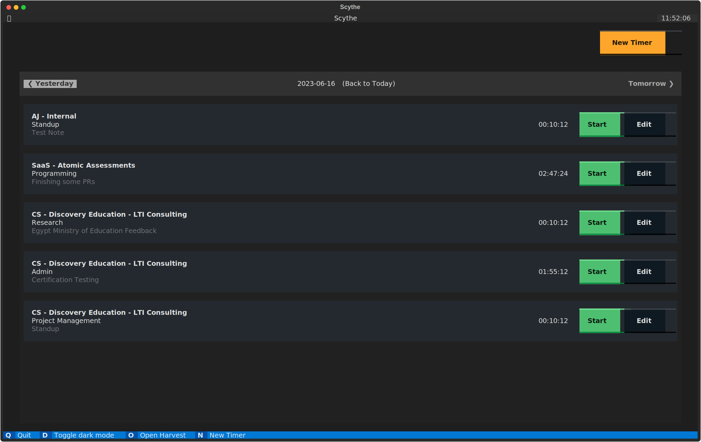

# Scythe



Scythe is a TUI and set of CLI utilties for interacting with the Harvest Time tracking Application

## Installation

Installable via pip

```
pip install scythe-cli
```

## Setup

First, you need to authenticate Scythe to your harvest account.

To do this, run the following command:

```
scythe init
```

This will open a new browser tab to perform an OAuth flow with Harvest. Once you have authenticated, you will be redirected to a page with a code. Copy this code and paste it into the terminal.

## Usage

### TUI
Start the TUI with

```
scythe
```

The interface has the following features:

- View all timers for a given day
- Start a new timer
- Stop a running timer
- Edit a Timer
- Delete a Timer


### CLI
The CLI also has a few other utilties:

`scythe timer` - The Scythe Timer namespace has some utilties for interacting with timers. `scythe timer --help` for more info

`scythe projects` - List all the projects and tasks that you have access to


#### Quickstarting
Quickstarting is a feature of Scythe that allows you to start a timer with a single command. This is useful for setting up a timer for a task that you do frequently.

To create a new quickstart entry run:

```
scythe quickstart add <name>
```

This will create a new quickstart entry with the name `<name>`. It will prompt you with a list of projects and tasks to choose from (And optionally, a note & a command to execute after the timer start). Once you have completed the prompt, you can start the timer with:

```
scythe quickstart <name>
```

This will start a timer with the details you entered when creating the quickstart entry and will execute the command you entered (if any).

`
